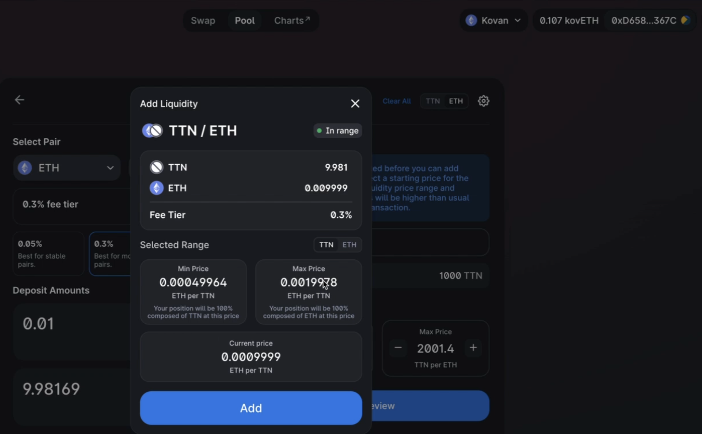
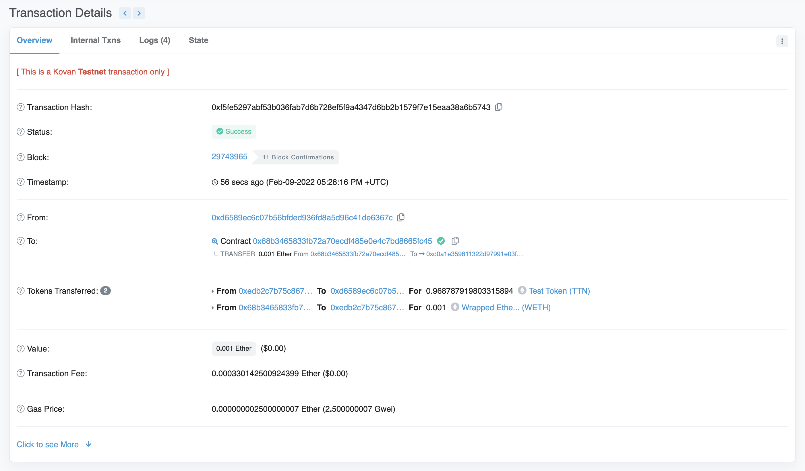

# First Deployed Token

## Description
My first token deployed to the kovan test network. The token added TTN was assembled using a guide by Dapp University. 
## What was Learned
- How to create a test network wallet and add ETH to the wallet using https://faucets.chain.link/
- How to use Remix IDE
- How Contracts in Solidity are assembled with constructors, mappings, and functions 
- How to deploy a token to the kovan test blockchain network and add liquidity so that you can trade it on uniswap

## Table of Contents
- [Setup Instructions](#setup-instructions)
- [Usage Information](#usage-information)
- [Questions](#questions)
- [Video](#video)

## Setup Instructions
1. Copy Token.sol from the contracts folder in this repo into the contracts folder in remix IDE

2. Use https://faucets.chain.link/ and set Network to kovan then copy and paste your kovan network metamask address into Testnet account address. click send request and it will wait for it too finish and check your metamask for your test ETH

## Usage Information
NOTE: throughout these steps you will run into gas fees that you have to pay with your kovan metamask wallet, I did not mention them in the steps but when one appears just click confirm.
1. Refer to image below. Go to the compile tab and set the version to 0.8.6 although this should also work with later versions of solidity as well.

2. Go to deploy and run transactions tab. set enviroment to injected Web3 and metamask will get injected, make sure to set your network in metamask to kovan. As we don't want to use real currency to deploy the token. 
- Under Deploy tab at the bottom set your NAME to whatever you want your token to be called, then set the SYMBOL to whatever you want but preferable an abbreviation for your token name.
- Set _DECIMALS to 18, then set the _TOTALSUPPLY to 1000000000000000000000000 
- Click transact and it will take you to metamask where you will pay a gas fee from your kovan test wallet.

3. Go to https://kovan.etherscan.io/ and paste in the contract address in the search bar from the above image and check to make sure there is a transaction. Might take a minute or two to load. 

4. Go to the Contract tab and click Verify and Publish. 

5. Input the following information. You can leave the license as No License if you would like.

5. Copy and paste all the code from your Token.sol file from Remix IDE into the text box under Enter the Solidity Contract Code Below. (displayed outside of the image) scroll down and complete the im not a robot catcha then click Verify and Publish.

6. Go to https://app.uniswap.org/#/pool?chain=kovan and click + New Position 

7. Next you want to click Select a Token then paste in your contract address for your token and import the token.
- select 0.3% for fee tier
- set starting price too 1000
- min price 500 
- max price 2000 (these could all be set to whatever you want, I recommend using the criteria I set so that it will be in range when it comes to step #8.)
- deposit amount is 0.01 ETH
- click Approve TTN
- Excuse me for not using the same contract address in the rest of the steps. It will not matter as the process is the exact same for each token, so don't think that you need to use a different contract address. 

8. In the top right of the uniswap pool screen you will see it is pending, wait till it finishes and the following will appear. Then click on preview and the image after the one below will appear, it should be in range if you used the criteria I used in step #7. Then click add

9. You may need to reload to see that the liquidity pool has been added. But the following should show up with the token we imported in this case it's TTN. ignore the other coins as those are from previous tests.

10. Last step is to go to https://app.uniswap.org/#/pool?chain=kovan then import your token by pasting in the contract address from remix IDE. Then you can buy a very small amount as the liquidity pool is very low, so use 0.001 ETH to swap with. After swap click view transaction as shown in the second image. then the last image shows the completed transaction through uniswap.(excuse the fact that in the video I missed that the transaction was actually still loading and it hadn't shown the Tokens Transfered row as it does in the last image below)

## Contribution Guidlines
Open Source

## License
This project is licensed under the terms of the [MIT](https://opensource.org/licenses/MIT) license

## Questions
My Github Profile: [cluck135](https://github.com/cluck135)

Email me your questions at: [casenluck@gmail.com](mailto:casenluck@gmail.com)

## Video
Watch the following videos in order for a guide on this project: 
[Video #1](https://watch.screencastify.com/v/Dqi6tCCKP0qsUVUrfSal)
[Video #2](https://watch.screencastify.com/v/8hQpQ1hgXsPnDs7Ay86t)

